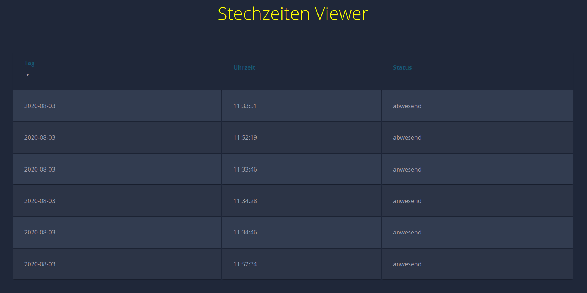

= **Stechzeiten**

== **Install:**

=== **First of all we need Python3 and pip3:**
==== For Ubuntu/Debian/RaspberryPiOS:
[source,bash]
----
sudo apt install python3-dev python3-pip
----

=== *Then we need spidev and the mfrc522 module:*
[source,bash]
----
sudo pip3 install spidev
sudo pip3 install mfrc522
----

=== *If you on RaspberryPiOS(former Raspbian) you also need to activate spi over the raspi-config menu, and don't forget the reboot.*

== **Goals:**

* [x] *connection to database and write data into* 
* [x] *Web Viewer* 

== *A project by Lukas Bonrath*

== Picture from the Webviewer:

