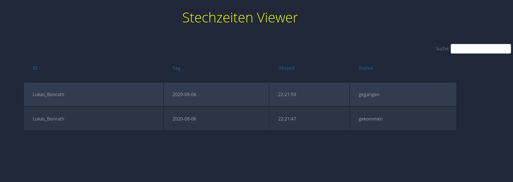

= **Stechzeiten**

== **Install:**

=== **Simply use my install script:**

You must manually install a Webserver.
If you are done make this:

[source,bash]
----
git clone https://github.com/lucki1000/Stechzeiten.git
cd Stechzeiten
chmod +x install.sh
./install.sh
----

=== **The manually steps are here listed:**
==== For RaspberryPiOS:

Enable the SPI in the raspi-config menu, then install a web server of your choice and the requiered depencies to use stechzeiten.py 
[source,bash]
----
sudo apt install {your webserver} mariadb-common mariadb-server python3-dev python3-pip tmux -y
----
after that we need also python packages, were are installed with:

[source,bash]
----
sudo pip3 install spidev
sudo pip3 install mfrc522
sudo pip3 install mysql
sudo pip3 install mysql-connector-python-rf
----
Then clone my repository with:
[source,bash]
----
git clone https://github.com/lucki1000/Stechzeiten.git
----
and copy all files from the website folder in your webservers root path then you can edit or run create_database.sh to create the struct in MYSQL/Maria-DB, you can also use my systemd unit who i created and put the folder stechzeiten in /etc/ or you can run it manually with:

[source,bash]
----
python3 stechzeiten/stechzeiten.py
----

and thats all, now can use it.

== **Goals:**

* [x] *connection to database and write data into* 
* [x] *Web Viewer* 

== Picture from the Webviewer:

== *A project by Lukas Bonrath*